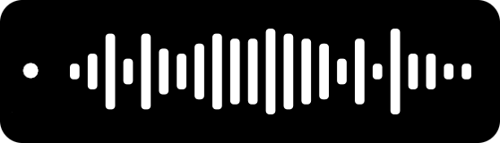
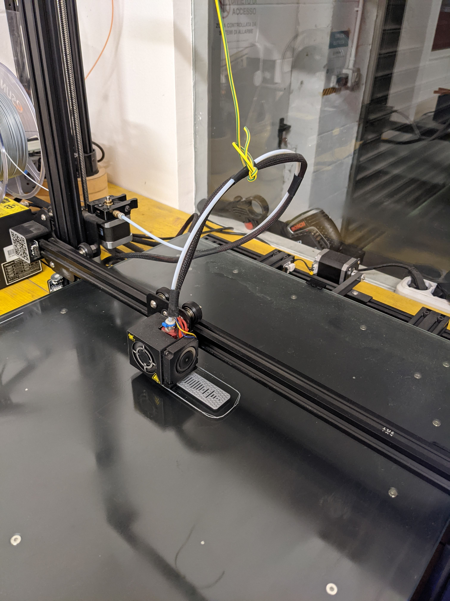
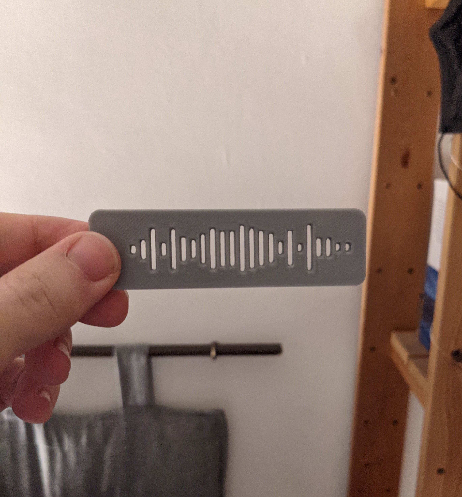

# 3D printer project
## Starting point
After downloading the spotify link to a song, an hole has been added and the border of the object have been modified.
&nbsp;
&nbsp;

&nbsp;

## First prototype
Below you can find an image of the partial product in printing phase.
&nbsp;
&nbsp;

&nbsp;
After printing:
&nbsp;

